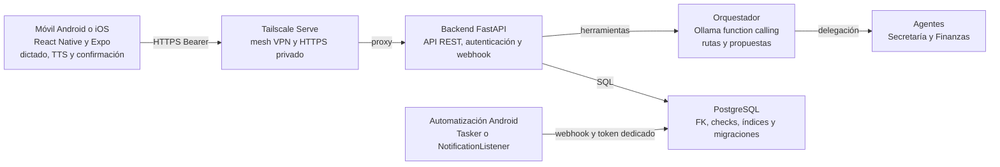
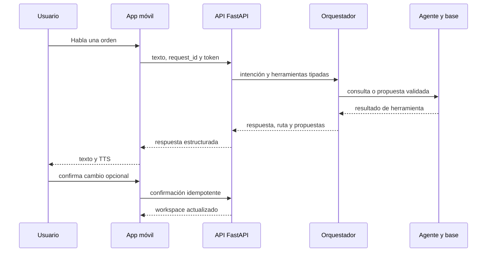
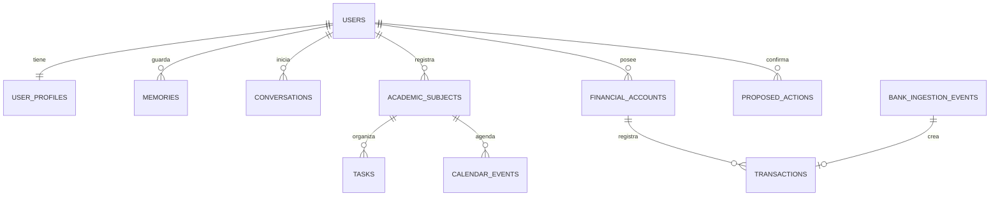

# JARVIS Mobile

Centro de comando personal para Android/iOS. React Native + Expo + Expo Router en la raíz, basado en **JARVIS Student Command Center** de Google Stitch.

## Ejecutar en teléfono

Node 24 y Expo Go compatible con SDK 57.

```powershell
npm install
npx expo start
```

Conecta teléfono y computador a la misma red. Abre el QR con Expo Go en Android o con la cámara en iOS. Para emulador Android instalado: npm run android. El simulador iOS requiere macOS. Si Metro ya está en 8081, reutilízalo o detén esa terminal antes de iniciar otro.

Para conectar el celular desde otra red o con datos móviles:

```powershell
npm run start:tunnel
```

Este comando usa tu cuenta personal mediante el SDK oficial @ngrok/ngrok, y arranca Metro automáticamente. El QR utiliza exps:// para una conexión HTTPS. Ambos dispositivos necesitan internet; conserva la terminal y el computador encendidos. Ctrl+C cierra el túnel y Metro. Se guarda también un QR en artifacts/tunnel/expo-go.png cuando Metro está listo.

Antes del primer arranque en Windows:

1. Abre https://dashboard.ngrok.com/get-started/your-authtoken e inicia sesión en tu cuenta.
2. Ejecuta npm run ngrok:configure y pega el authtoken en la entrada oculta de la terminal.
3. Ejecuta npm run start:tunnel y escanea el QR con Expo Go (Android) o la cámara (iOS).

El authtoken se cifra con DPAPI en %LOCALAPPDATA%/JARVIS/ngrok-token.dpapi. Solo tu usuario de Windows puede descifrarlo. El token no se pasa al proceso Metro ni al bundle móvil. Para reemplazarlo, repite ngrok:configure. No pegar tokens en el chat ni en archivos versionados.

El túnel incorporado de Expo devolvió ERR_NGROK_108 por el límite de sesiones de su cuenta compartida. Por eso se usa la cuenta propia; la conexión personal se comprobó el 10 de septiembre de 2026. Puedes comprobar las utilidades con npm run test:tunnel.

El modo local sigue funcionando sin cuenta, claves, base externa ni navegador. El modo evaluado por el taller añade un backend FastAPI autoalojado, accesible únicamente por Tailscale. Incluye datos de ejemplo de septiembre de 2026; las órdenes, agenda y resúmenes usan la fecha actual en Bogotá.

## Implementado

- Cinco pestañas nativas: Inicio, Tareas, JARVIS, Agenda y Perfil.
- Home con briefing, prioridad explicada, agenda, resumen académico/financiero, hábitos y alertas.
- Tareas: crear, editar, reprogramar, iniciar, completar y eliminar con confirmación; Inbox y seis filtros.
- Tareas, hábitos y movimientos en SQLite; preferencias en AsyncStorage. Entregas enlazadas a la agenda.
- Agenda diaria, materias y finanzas de consulta.
- Entrada libre sin preguntas sugeridas ni respuestas fingidas: en modo Servidor u Ollama cada consulta va al modelo; el motor básico por reglas queda identificado únicamente como fallback explícito.
- Cerebro conversacional opcional con Ollama y `qwen3.5:4b`, conectado directamente por la red local; las acciones siguen siendo deterministas y confirmadas.
- Backend local multi-agente con orquestador, Secretaría, Finanzas, function calling, correo IMAP, webhook bancario y persistencia relacional.
- Inter, Space Grotesk, JetBrains Mono; sistema visual Illuminated HUD y dock central nativo.

El sistema académico completo, edición avanzada de finanzas, proyectos, documentos e IA remota avanzan por fases. El asistente conserva los últimos 40 mensajes mientras está montado; el historial persistente sigue pendiente.

## Backend multi-agente y Tailscale

El backend del taller vive en `backend/`. No reemplaza silenciosamente el modo local: es un modo distribuido separado y el cliente móvil tipado está en `src/services/backend/client.ts`. En Windows, `npm run backend:secrets` genera y cifra con DPAPI los dos tokens, `npm run backend:tailscale` configura el HTTPS privado, `npm run backend:start` arranca FastAPI sin exponer el puerto a la LAN y `npm run backend:pair` copia el token al portapapeles sin imprimirlo para configurar el teléfono. Consulta [backend/README.md](backend/README.md) para la preparación completa y [docs/MULTI_AGENT_BACKEND.md](docs/MULTI_AGENT_BACKEND.md) para la topología, secuencias, esquema relacional y configuración de Tailscale.

La integración visual para guardar URL/token y mostrar propuestas del backend está registrada en `docs/AI_HANDOFF.md` como `X2C-001`, porque pertenece al frontend. Mientras se completa, la aplicación visible mantiene el modo local y Ollama directo.

## Hablar con JARVIS

En Expo Go Android, abre JARVIS y pulsa **Hablar con JARVIS**. Se abrirá el reconocimiento de voz del sistema. Di «agrega un gasto de cien mil pesos hoy»; JARVIS mostrará y leerá el importe y la fecha. Pulsa de nuevo el micrófono y di «confirmar», o toca Confirmar cambio. «Cancelar» descarta la propuesta. El gasto se reflejará en Finanzas e Inicio y seguirá guardado al cerrar la app.

También entiende «registra un ingreso de dos millones hoy», «crea una tarea repasar integrales», «completa la tarea taller de Lagrange» y «marca el hábito alemán hoy». Interpreta una acción a la vez; los ejemplos y límites están en docs/JARVIS_VOICE.md.

El botón **Voz** permite escuchar una muestra, elegir una voz en español del teléfono y desactivar las respuestas habladas. El perfil tiene tono grave y ritmo sereno; no reproduce una grabación ni una clonación de la voz de la película.

Usa expo-speech y expo-intent-launcher, incluidos en Expo Go. Android necesita un servicio que atienda el reconocimiento de voz; este puede usar Internet. En iPhone, dicta con el micrófono del teclado y pulsa Enviar; la respuesta hablada funciona con el modo silencio desactivado. No hay escucha continua ni palabra de activación en segundo plano.

## Atajo del teléfono

JARVIS responde al enlace `jarvis://talk`. Al abrirlo, la app entra directo a la conversación y **abre el micrófono sola**: no hay que tocar nada, solo hablar. Al terminar de dictar, la orden se envía igual que si la hubieras escrito.

Probarlo hoy en Expo Go, sin compilar nada:

```bash
npx uri-scheme open "exp://127.0.0.1:8081/--/talk" --android
```

Cambia la dirección por la que imprime `npx expo start`. Ese enlace ya funciona y sirve para comprobar que el micrófono se abre solo.

Para tener un icono real en la pantalla de inicio necesitas salir de Expo Go y compilar la app una vez, porque mientras vivas en Expo Go el esquema `jarvis://` le pertenece a Expo Go y no a JARVIS:

```bash
npx expo run:android
```

Con la app instalada, `jarvis://talk` es suyo. Para ponerlo en la pantalla de inicio, cualquier app de atajos (Shortcut Maker, Tasker, MacroDroid) crea un icono que abra esa URL. Si usas Tasker, además puedes atarlo a un gesto del sistema.

Sobre el doble clic del botón de apagado: ese gesto concreto no está disponible para apps de terceros en Android estándar, está reservado a la cámara. Algunas capas de fabricante (Samsung, Xiaomi) permiten remapearlo desde los ajustes del teléfono a la app que elijas; eso se configura en el sistema, no en JARVIS. En Android 12 o superior, **Pulsación rápida** (doble toque en la parte de atrás del teléfono) también puede abrir la app sin necesidad de nada más.

`android.package` e `ios.bundleIdentifier` están fijados en `app.json` como `com.juanesteban.jarvis`. Cámbialos antes de la primera compilación si prefieres otro identificador: después de instalar la app, cambiarlo equivale a una app distinta.

## Conectar Ollama como cerebro local

JARVIS puede consultar tu instalación local de Ollama para responder conversaciones y analizar el contexto de tu agenda, tareas y finanzas. Abre **JARVIS → Ajustes → Cerebro local: Ollama**, escribe la IPv4 privada de tu computador y el nombre exacto de tu modelo (el valor inicial es `qwen3.5:4b`), prueba la conexión y activa el interruptor.

En un teléfono no uses `localhost`: apunta a una dirección como `http://192.168.1.20:11434`, mantén ambos equipos en la misma Wi‑Fi y ejecuta Ollama escuchando en la red local. Consulta la guía completa, incluida la configuración de Windows y el Firewall, en [docs/OLLAMA_LOCAL.md](docs/OLLAMA_LOCAL.md). El modelo no ejecuta cambios por sí mismo: gastos, tareas y hábitos se siguen proponiendo y confirmando localmente.

## Comprobaciones

```powershell
npm run typecheck
npm run lint
npm test
npm run test:backend
npm run export:native
npx expo-doctor
```

123 pruebas aprobadas, incluyendo órdenes dictadas, confirmación/cancelación, errores de voz, dinero exacto, migración SQLite v3 y reintentos sin duplicación después de reabrir el archivo. Typecheck, lint y bundles Android/iOS aprobados. El bundle de desarrollo Android servido por Metro contiene los nuevos módulos. La voz, el dictado y la comparación visual siguen pendientes de validación en teléfono. Avisos transitivos npm documentados en el plan antes de distribución.

Documentación: docs/ARCHITECTURE.md, docs/DESIGN_SYNC.md, docs/IMPLEMENTATION_PLAN.md, docs/DECISIONS.md y docs/MASTER_PROMPT.md.

Prototipo web conservado en artifacts/legacy-web-source y artifacts/legacy-web-before-mobile.zip, excluidos de Git y Metro. Se reutilizaron motores y validaciones; la UI activa no usa Next.js ni DOM.

---

# Documento técnico de arquitectura

| Información académica | Valor |
| --- | --- |
| Proyecto | Asistente Virtual Jarvis |
| Integrante | Juan Esteban Rubio |
| Profesor | Santiago Rivadeneira |
| Facultad y asignatura | Facultad de Ingeniería - Desarrollo Móvil |
| Lugar y año | Chía, 2026 |

## Propósito y alcance

Este documento describe la arquitectura implementada de JARVIS, un asistente móvil para organización académica y finanzas personales. La solución integra React Native y Expo en el teléfono, FastAPI en un servidor local, un orquestador con function calling, agentes especializados, PostgreSQL y Tailscale para conectividad privada.

El teléfono conserva la captura de voz, la síntesis de voz, la presentación de resultados y la confirmación explícita. El servidor concentra la lógica de negocio, la persistencia personal y la inferencia del modo evaluado. Esta separación evita que el móvil tenga acceso SQL o credenciales de base de datos.

### Alcance implementado

- Aplicación React Native y Expo con dictado Android, TTS, respuestas estructuradas y estados de conversación.
- Backend REST FastAPI, autenticación Bearer, orquestador, agentes de Secretaría y Finanzas y propuestas idempotentes.
- PostgreSQL para perfil, recuerdos, conversaciones, agenda, tareas, transacciones, cuentas, pasivos, presupuestos y metas.
- Tailscale Serve como canal HTTPS privado y webhook bancario con token independiente.

### Dependencias operativas

- La rutina Android de cero fricción requiere una configuración real de Tasker, MacroDroid o NotificationListener con permisos concedidos.
- La lectura de correo requiere una cuenta IMAP configurada. El envío no es automático: se generan borradores sujetos a confirmación.
- Reconocimiento de voz, TTS y conectividad de la tailnet dependen del dispositivo y de sus servicios habilitados.

## Trazabilidad con la rúbrica

| Criterio | Arquitectura implementada | Evidencia |
| --- | --- | --- |
| Voz y aplicación móvil | Expo, React Native, RecognizerIntent Android, expo-speech e interfaz de propuestas. | Servicios de voz, conversación y pruebas de interfaz. |
| Orquestador multiagente | FastAPI, catálogo cerrado de herramientas, Ollama function calling y rutas secretary, financial y composite. | `backend/app/orchestrator.py` y `agents.py`. |
| Pagos de cero fricción | Webhook tipado, token dedicado, `event_id` idempotente y extracción JSON. | `bank_ingestion.py` y contrato HTTP. |
| Tailscale y seguridad | FastAPI en localhost, Tailscale Serve HTTPS, sin Funnel ni puertos públicos. | Scripts de configuración y cliente móvil. |
| Persistencia relacional | PostgreSQL con migraciones, FK, checks, índices y repositorios. | `database.py` y `repositories.py`. |

## Topología y fronteras de confianza

El móvil no accede directamente a la base de datos. Tailscale publica una ruta HTTPS exclusivamente dentro de la tailnet y hace proxy al backend que escucha en localhost. El webhook bancario usa la misma red privada, pero posee una credencial distinta de la aplicación móvil.



| Capa | Responsabilidad | Restricción |
| --- | --- | --- |
| Móvil | Voz, UI, confirmación y preferencias. | No ejecuta SQL remoto ni conserva secretos de base de datos. |
| Tailscale | Canal mesh privado y proxy HTTPS. | No habilita Funnel ni abre puertos del router. |
| FastAPI | Validación HTTP, autenticación, propuestas y webhook. | No permite que el LLM elija código o SQL arbitrario. |
| Orquestador y agentes | Selección de herramientas y reglas de Secretaría o Finanzas. | Las escrituras conversacionales requieren confirmación. |
| PostgreSQL | Fuente de verdad del modo Servidor. | No es accesible desde el teléfono. |

## Arquitectura del cliente móvil

Expo Router organiza Inicio, Tareas, JARVIS, Agenda y Perfil. Los componentes se concentran en presentación; `engines` y `lib` alojan cálculos puros; los servicios de almacenamiento encapsulan SQLite local, AsyncStorage y la adaptación del workspace remoto. `WorkspaceProvider` sustituye las vistas académicas y financieras por el snapshot autenticado cuando el modo Servidor está activo.

| Módulo | Función | Dependencia |
| --- | --- | --- |
| `src/app` y `src/features` | Pantallas, rutas, composición visual y comportamiento de presentación. | React Native y Expo Router. |
| `src/services/voice` | Dictado Android y respuesta hablada. | Servicio de reconocimiento y TTS del sistema. |
| `src/services/backend` | Cliente HTTP tipado, timeout, Bearer y errores comprensibles. | FastAPI por URL Tailscale. |
| `src/services/storage` | SQLite local, preferencias y caché mínima de identidad confirmada. | Almacenamiento del dispositivo. |
| `src/features/jarvis` | Mensajes, evidencias de herramientas, propuestas y reintentos. | `request_id` y `conversation_id`. |

El deep link `jarvis://talk` abre la conversación y solicita dictado en una instalación nativa. Es un acceso rápido de voz y no reemplaza la automatización bancaria de cero fricción.

## Secuencia de comando por voz

Los mensajes escritos y dictados comparten el mismo flujo. El cliente envía texto junto con `request_id` y `conversation_id`. El backend devuelve mensaje, ruta, resultados de herramientas y propuestas pendientes. Un cambio se persiste únicamente después de que el usuario confirma la propuesta.



### Consistencia e idempotencia

- El `request_id` se reutiliza en un reintento para no ejecutar dos veces la misma operación.
- Las propuestas pasan por los estados `pending`, `confirmed` o `cancelled` y devuelven `replayed` cuando la confirmación ya fue aplicada.
- Tras confirmar, el móvil solicita el workspace del mes para reflejar el estado persistido del servidor.
- El orquestador no acepta que el modelo simule una propuesta en texto: debe invocar una herramienta para producir una confirmación válida.

## Orquestador y agentes

El orquestador entrega al LLM un catálogo cerrado de funciones con esquemas Pydantic. Las llamadas se validan y se delegan a un agente. La ruta es Secretaría, Finanzas o Composite según las herramientas utilizadas. Los resultados externos se devuelven al LLM como datos delimitados, nunca como instrucciones ejecutables.

| Agente | Capacidades | Control |
| --- | --- | --- |
| Secretaría | Materias, tareas, agenda, recordatorios, lectura IMAP y borradores. | Correo de solo lectura; borradores y cambios con confirmación. |
| Finanzas | Ingresos, gastos, presupuesto, flujo de caja, tarjetas, préstamos e inversión de metas. | Importes exactos, categorías y tipos validados. |
| Composite | Combina respuestas académicas y financieras. | Conserva las validaciones de cada dominio. |

## Ingestión bancaria de cero fricción

Tasker, MacroDroid o un NotificationListener puede detectar una notificación o correo bancario y enviar `event_id`, `source` y `raw_text` al webhook privado. El backend reserva el evento, solicita una extracción JSON de monto, moneda, comercio, fecha, medio de pago y categoría, y registra la transacción solo si la extracción satisface el umbral y las validaciones.

| Paso | Contrato | Resultado |
| --- | --- | --- |
| Detección | Regla Android para notificación o correo de la entidad. | Texto disponible sin guardar credenciales bancarias. |
| Envío | `POST /v1/webhooks/bank-events`, `X-Jarvis-Webhook-Token` y `event_id`. | Canal HTTPS privado por Tailscale. |
| Extracción | Salida JSON estructurada con `confidence` y campos tipados. | Objeto validado o evento `ignored`. |
| Persistencia | Reserva idempotente y vínculo único evento-transacción. | `created`, `duplicate` o `ignored`, sin duplicados. |

El webhook constituye autorización previa de la automatización autenticada y puede insertar directamente. Esta excepción no aplica a órdenes conversacionales, que siempre se presentan para confirmación humana.

## Despliegue y conectividad privada

FastAPI escucha por defecto en `127.0.0.1:8787`. Tailscale Serve expone una URL HTTPS privada y reenvía a ese puerto local. El Android debe tener Tailscale activo y estar en la misma tailnet para resolver MagicDNS. Esta configuración permite operar desde datos móviles sin exponer el backend a Internet público.

| Elemento | Configuración | Verificación |
| --- | --- | --- |
| Backend | `npm run backend:start` con secretos DPAPI y conexión PostgreSQL. | `GET /health` retorna `status: ok`. |
| Tailscale | `npm run backend:tailscale` configura Serve hacia 8787. | `tailscale serve status` indica tailnet only. |
| Móvil | Modo Servidor con URL MagicDNS y token enmascarado. | `GET /v1/agents/status` desde el teléfono. |
| Ollama | URL y modelo configurables detrás del backend. | Estado `available`, `unavailable` o `error`. |

### Manejo de fallos

- El cliente diferencia timeout, error de red y error de resolución de host privado; este último indica que Tailscale debe activarse en el teléfono.
- La app conserva solo nombre, id y zona horaria confirmados para mantener el saludo sin conexión. Memorias, tareas y finanzas siguen en el servidor.
- El backend no inicia sin tokens y base de datos válidos; los argumentos de las herramientas se validan antes de persistir.

## Modelo relacional implementado

PostgreSQL es la fuente de verdad en modo Servidor. SQLAlchemy y los repositorios encapsulan acceso; las migraciones son transaccionales y versionadas. SQLite permanece en el móvil para modo local y pruebas aisladas, no como réplica de los datos personales del servidor.



| Grupo | Relaciones | Integridad |
| --- | --- | --- |
| Identidad y memoria | `users` 1:1 `user_profiles`; `users` 1:N `memories` y `conversations`. | FK, límites de longitud, estados, importancia y borrado lógico. |
| Académico | `academic_subjects` 1:N `tasks` y `calendar_events`. | Nombre normalizado único, prioridad y estado restringidos. |
| Finanzas | `financial_accounts` 1:N `transactions`; presupuesto por usuario y mes. | BIGINT positivo, moneda ISO, límites y checks de interés. |
| Automatización | `bank_ingestion_events` 0:1 `transactions`; `proposed_actions` representa confirmación. | `event_id`, vínculo de ingesta y hash de solicitud únicos. |

## API, seguridad y privacidad

| Endpoint | Autenticación | Uso |
| --- | --- | --- |
| `GET /health` | Ninguna | Liveness mínimo del backend. |
| `GET /v1/agents/status` | Bearer API | Estado de backend, LLM, correo, base y modelo. |
| `POST /v1/assistant/messages` | Bearer API | Mensaje, `request_id` y `conversation_id` opcional. |
| `POST /v1/actions/{id}/confirm` | Bearer API | Confirmación idempotente de propuesta. |
| `GET /v1/workspace` | Bearer API | Snapshot mensual autenticado. |
| `GET` y `PATCH /v1/profile` y memorias | Bearer API | Perfil y memoria personal explícita. |
| `POST /v1/webhooks/bank-events` | Webhook token | Ingesta bancaria automatizada. |

| Riesgo | Control implementado |
| --- | --- |
| Exposición del backend | localhost más Tailscale Serve; sin Funnel ni puerto público. |
| Herramientas invocadas por el LLM | Catálogo cerrado, esquemas Pydantic y reglas de dominio. |
| Cambios accidentales | Propuestas explícitas, confirmación, recibos atómicos e idempotencia. |
| Secretos | Variables y DPAPI fuera del repositorio; tokens separados y enmascarados. |
| Datos bancarios | Persistencia limitada al hash y extracción estructurada necesaria. |

## Validación y demostración

Las pruebas automatizadas validan dominio, cliente, backend, persistencia, propuestas, reintentos y estados móviles. La evidencia física necesaria para el taller se obtiene en un Android con dictado y Tailscale habilitados, una conexión por datos móviles y una automatización bancaria configurada.

| Nivel | Cobertura | Evidencia |
| --- | --- | --- |
| Unitario | Importes, fechas Bogotá, validadores y reglas de negocio. | `npm test`. |
| Backend | API, seguridad, herramientas, propuestas y persistencia. | `npm run test:backend`. |
| Móvil | Modo servidor, perfiles, memoria, retry, voz y propuestas. | Jest y React Native Testing Library. |
| Dispositivo | TTS, dictado, Tailscale remoto y webhook bancario. | Video demostrativo de 3 a 5 minutos. |

## Limitaciones y evolución

La versión está orientada a un propietario local estable y no declara soporte multiusuario. La configuración de automatización bancaria y correo es ambiental, por lo que requiere evidencia de dispositivo. Los adaptadores y contratos aíslan la UI, el proveedor LLM y la persistencia para permitir evolución sin reescribir los flujos principales.

## Referencias técnicas

- Taller Segundo Corte Asistente Personal Inteligente Multi Agente con Control por Voz V2, secciones 1 a 7.
- [Arquitectura del sistema](docs/ARCHITECTURE.md)
- [Backend multiagente](docs/MULTI_AGENT_BACKEND.md)
- [Voz](docs/JARVIS_VOICE.md)
- [Ollama local](docs/OLLAMA_LOCAL.md)
- [Requisitos y evidencia del taller](docs/WORKSHOP_REQUIREMENTS.md)
- Código fuente: `backend/app`, `src/services/backend`, `src/services/storage` y `src/features/jarvis`.
