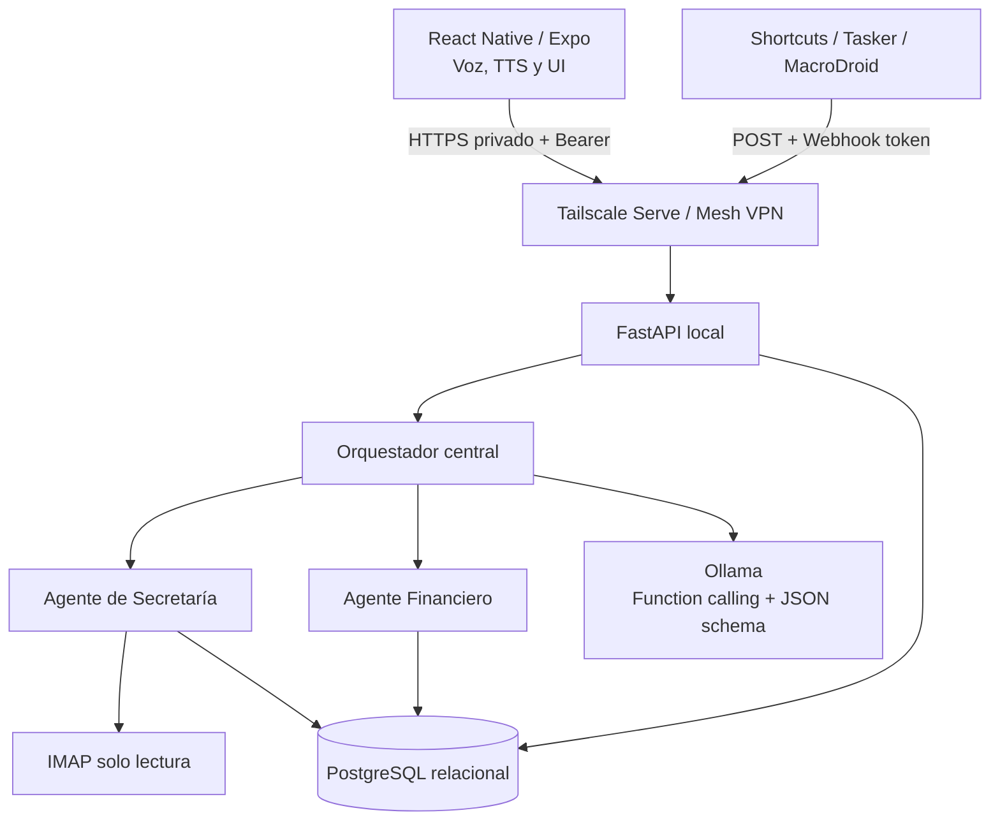
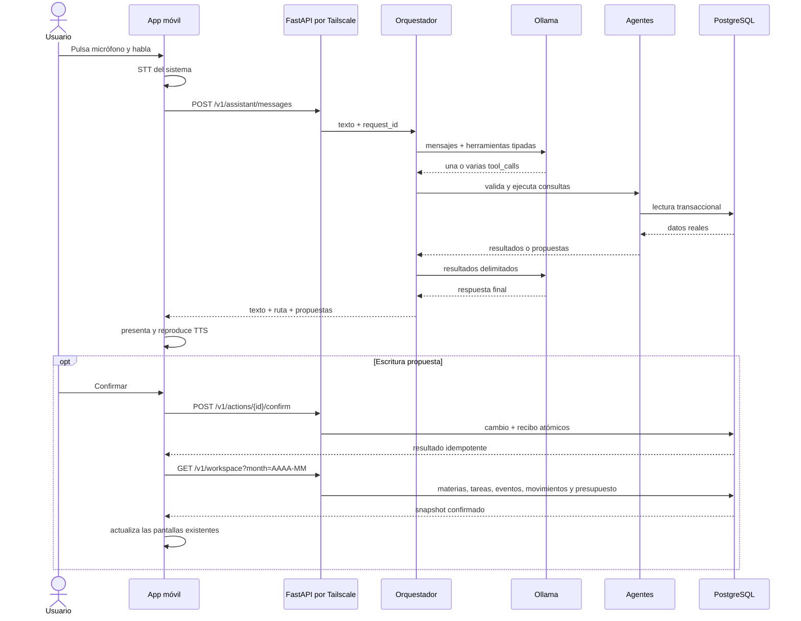
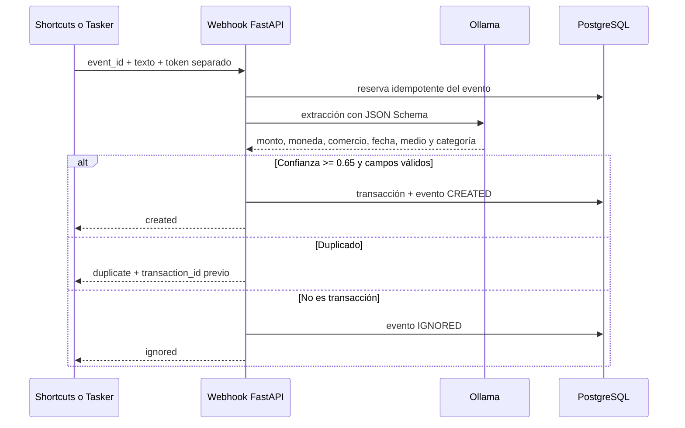
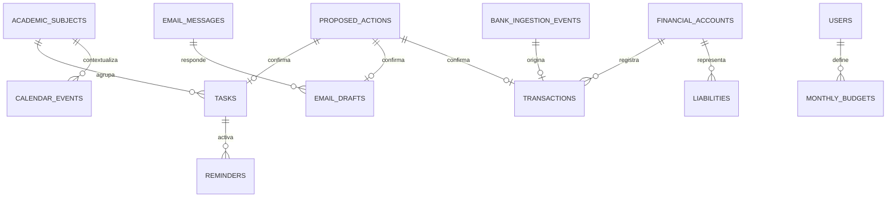

# Arquitectura distribuida multi-agente

## Objetivo

Esta capa cumple el modo evaluado por el taller sin eliminar el modo local existente de JARVIS. El modo distribuido mueve la inferencia, el acceso a correo, la ingesta bancaria y la base relacional a un servidor local autoalojado. El teléfono conserva captura de voz, TTS, presentación y confirmación explícita.

## Topología

PostgreSQL es la persistencia del servidor local. SQLAlchemy mantiene el contrato de repositorios y psycopg realiza la conexión; el móvil nunca recibe credenciales de base de datos ni accede a tablas directamente. SQLite permanece en el teléfono para el modo offline y en pruebas temporales del backend. El servidor PostgreSQL comienza sin información personal de demostración.

## Secuencia de comando por voz

## Secuencia de ingesta bancaria

## Esquema relacional

Además de correo y finanzas, el esquema contiene `academic_subjects`, tareas asociadas, `calendar_events`, `monthly_budgets`, `users`, `user_profiles`, `memories`, `conversations` y `conversation_messages`. La versión actual usa un propietario local estable (`owner`); no afirma soporte multiusuario. Los recuerdos distinguen tipo, fuente, importancia, expiración, confirmación y borrado lógico. El historial deduplica cada rol por `conversation_id` y `request_id`.

Tablas adicionales: `savings_goals`, `agent_runs` y `schema_migrations`. Los importes se guardan en unidades menores como enteros de 64 bits (el valor expresado en COP multiplicado por 100); las monedas usan códigos ISO de tres letras. Las claves foráneas están activas en cada conexión y las migraciones son transaccionales.

## Límites de seguridad

- El backend falla al iniciar si los tokens están vacíos o son cortos.
- API móvil y webhook usan secretos diferentes y comparación en tiempo constante.
- No hay CORS abierto ni túnel público. FastAPI escucha por defecto solo en localhost y Tailscale Serve termina HTTPS dentro de la tailnet.
- El texto bancario crudo no se conserva; solo su hash y la extracción mínima.
- El modelo nunca ejecuta SQL ni selecciona funciones arbitrarias: solo nombres registrados y argumentos validados por Pydantic.
- Correos y resultados de herramientas se tratan como datos no confiables dentro del prompt.
- Enviar correo no está habilitado; se guardan borradores tras confirmación.

## Conectividad Tailscale

1. Instala Tailscale en el computador y el teléfono e inicia sesión en la misma tailnet.
2. Ejecuta una vez `npm run backend:secrets`; crea dos tokens aleatorios diferentes y los cifra con DPAPI fuera del repositorio.
3. Ejecuta una vez `npm run backend:tailscale`. El comando configura `tailscale serve --bg --yes 8787`, verifica que Tailscale este conectado e imprime la URL MagicDNS estable. Si la tailnet aun no tiene Serve habilitado, abre el enlace oficial que presenta Tailscale y autoriza la función.
4. Arranca FastAPI con `npm run backend:start`; escucha en `127.0.0.1:8787`. Ollama también puede permanecer en localhost porque solo el backend lo consulta.
5. Verifica con `tailscale serve status`. No uses Tailscale Funnel y no abras el puerto 8787 en el router.
6. Ejecuta `npm run backend:pair`: imprime únicamente la URL HTTPS privada y copia el token API
   protegido al portapapeles para pegarlo en los ajustes del teléfono. El token nunca aparece en la terminal.
6. Comprueba desde datos móviles `https://<equipo>.<tailnet>.ts.net/health` y después el endpoint autenticado.

Tailscale es infraestructura externa y su conexión real debe verificarse en los dos dispositivos; las pruebas automatizadas no pueden sustituir esa evidencia.

Fuentes oficiales: [Tailscale Serve](https://tailscale.com/docs/reference/tailscale-cli/serve), [CLI de Tailscale](https://tailscale.com/kb/1080/cli) y [MagicDNS](https://tailscale.com/docs/features/magicdns).
